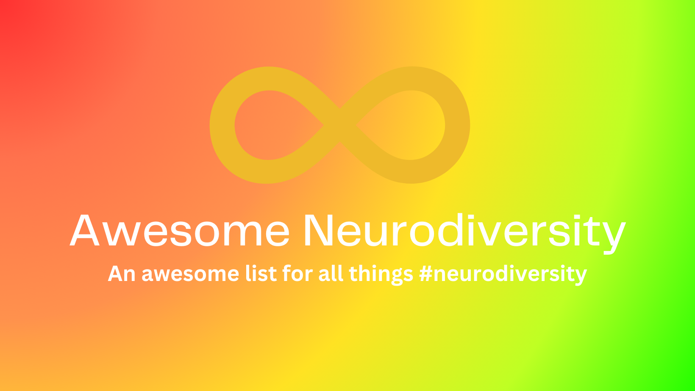

# Awesome Neurodiversity

<!-- markdownlint-disable MD033 MD010 MD042 MD053 -->

	
	

		Follow Andrei Jiroh on <a href="https://twitter.com/Kuys_Potpot">Twitter</a> or <a href="https://tilde.zone/@ajhalili2006">in the fediverse</a>. Share this project with our Linktree link: <a href="https://linktr.ee/AwesomeND"><code>linktr.ee/AwesomeND</code></a>
	

	 
	

		<a href="https://en.wikipedia.org/wiki/Neurodiversity">Neurodiversity</a> is a term to describe natural variations in the human brain, which relates to differences in the ways we think, process, learn and behave. (from <a href="https://www.texthelp.com/resources/neurodiversity/">TextHelp</a>)
	

	 

## Maintained with ❤️ by [Recap Time Squad](https://recaptime.eu.org)

Under Community Lores, our documentation arc for all things documentation projects and even this one, Recap Time Squad is currently where Andrei Jiroh mostly host his open-source projects like this.

**Trivia**: Did you know that Andrei Jiroh founded Recap Time Squad under its former name The Pins Team as a future YouTube channel in 2018, but in its current form is a hub for open source projects, whenever its software or not, among other things.

## Usage

Use "Find in" (shortcut: Ctrl/Cmd + F) feature in your browser to find a resource here.

Can't find it? See also resources listed in [the Public Neurodiversity Support Center](https://coda.io/@mykola-bilokonsky/public-neurodiversity-support-center/resources-62) and/or file a new issue via [GitHub](https://github.com/Community-Lores/awesome-neurodiversity/issues/new?assignees=ajhalili2006&labels=enhancement%2Cdocumentation&template=suggest-resource.yml).

## Contents

> :warning: **Warning**: This is currently a work in progress, as @ajhalili2006
> is ironing things behind the scenes. Patches and tickets are welcome,
>but please do check the [contributing guidelines](./CONTRIBUTING.md) for details.

* [Primer on Neurodiversity](#primer-on-neurodiversity)
* [Learn More About Each Neurotypes](#learn-more-about-each-neurotypes)
* [The Neurodiversity Community](#the-neurodiversity-community)
* [On Non-speakers]()
* [Neurodivergent Creators]()
* [Science Behind Neurodiversity](#science-behind-neurodiversity)
* [Neurodiversity at Work]()
* [Neurodiversity in Open-source]()

## Primer on Neurodiversity

Treat this as your starter pack/basics on the neurodiversity paradigm + movement.

* [**What is Neurodiversity?**](https://coda.io/@mykola-bilokonsky/public-neurodiversity-support-center/what-is-neurodiversity-37) - A short introduction to an enormous topic from the [Public Neurodiversity Support Center (PNDSC)](https://coda.io/@mykola-bilokonsky/public-neurodiversity-support-center/what-is-neurodiversity-37)

## Learn More about Each Neurotypes

> :construction: There are way more neurodivergent traits than currently existing neurotypes like [unnamed costellations](https://coda.io/@mykola-bilokonsky/public-neurodiversity-support-center/unnamed-constellations-neurotypes-traits-and-the-future-of-neuro-77). We'll update this list as soon as possible once the community in collaboration with the scientific community named new ones, although just like at PNDSC, we suspect that the future of Neurodiversity is actually a movement away from discrete neurotypes and towards a more deconstructed, trait-oriented taxonomy.

### Autism

> From [Neuroqueer](https://neuroqueer.com)'s page about [Autism](https://neuroqueer.com/what-is-autism/):
>
> _"Autism is a genetically-based human neurological variant. The complex set of interrelated characteristics that distinguish autistic neurology from non-autistic neurology is not yet fully understood, but current evidence indicates that the central distinction is that autistic brains are characterized by particularly high levels of synaptic connectivity and responsiveness. This tends to make the autistic individual’s subjective experience more intense and chaotic than that of non-autistic individuals: on both the sensorimotor and cognitive levels, the autistic mind tends to register more information, and the impact of each bit of information tends to be both stronger and less predictable."_
>
> Also explained in [Neuroclastic](https://neuroclastic.com/autism/what-is-autism/) and [Public Neurodiversity Support Center](https://coda.io/@mykola-bilokonsky/public-neurodiversity-support-center/autism-48).

### ADHD

> From the [Public Neurodiversity Support Center's article](https://coda.io/@mykola-bilokonsky/public-neurodiversity-support-center/adhd-49):
>
> _"ADHD is perhaps the worst named neurotype in existence. Ostensibly “Attention Deficit Hyperactive Disorder”, ADHD can be at least as much about emotional regulation, time blindness and rejection sensitivity as it is about attention. This is fundamentally a difference in the way dopamine is released in the brain. Neurotypical brains receive dopamine for achieving tasks; ADHD brains receive dopamine for satisfying curiosity. This means our motivational systems are fundamentally at odds with everyone else’s, and it explains why our executive function can be so debilitatingly bad."_

## The Neurodiversity Community

* [**Autism 101: Resources from the Autistic community (from Neuroclastic)**](https://neuroclastic.com/autism-101-resources-from-the-autistic-community/) - An community starter pack on how the Autistic community operates by #ActuallyAutistic individuals themselves.[^1][^2]
* [**#ActuallyAutistic**](https://autism-advocacy.fandom.com/wiki/ActuallyAutistic) - A hashtag used by the Autistic community, originally in [Tumblr](http://www.tumblr.com/tagged/actuallyautistic) ([alternative tag](http://www.tumblr.com/tagged/actually%20autistic))[^3], but also exists in other platforms like Twitter and DeviantArt.
* **#AskingAutistics** (also [Ask An Autistic](https://autism-advocacy.fandom.com/wiki/Ask_An_Autistic) YouTube series from the Autistic Self Advocacy Network member and autistic advocate Amythest Schaber + its related hashtag, `#AskAnAutistic`) - If you have an burning question about all things autism and neurodiversity (whenever you're neurotypucal/non-autistic, autistic/neurodivergent yourself or an ally), use the hashtag in your posts.
* [**r/AutismTranslated**](https://reddit.com/r/autismTranslated) - A subredit founded by the creator of Public Neurodiversity Support Center, based on [a Twitter thread](https://twitter.com/mykola/status/1112883937272107008).

[^1]: Some links might be broken (especially domains and pages that are no longer existent), which we may plan to contact the Neuroclastic editiorial team soon about using `web.archive.org` for these links.
[^2]: Also applies to other neurotypes, especially in things like Person First vs Identity Language, on functioning labels and ABA.
[^3]: https://autisticadvocacy.tumblr.com/post/95007096162/what-is-with-the-tags-actuallyautistic-which

## On non-speakers

We use the term "non-speaker" over "non-verbal" because we belive in the use of  alternative and augmentative communication (AAC).

* [**On Using NonSpeaking, Minimally Speaking, Or Unreliably Speaking Over “Non-Verbal”: NonSpeakers Weigh In (from Neuroclastic)**](https://neuroclastic.com/on-using-nonspeaking-minimally-speaking-or-unreliably-speaking-over-non-verbal-nonspeakers-weigh-in/) - A different between these terms, especially from non-speaking autistics/NDs.

## Science behind Neurodiversity

<id="cw-medical-model">
> **Maintainers' note**: While we try our best to review every single scientific paper and article relating to each neurotypes for any signs of ableism/disablism/eugenics, please expect (expectionally high) usage of medical/pathological model of diability in language.

## License

This work (including any contributions) is licensed under a [Creative Commons Attribution 4.0 International License](http://creativecommons.org/licenses/by/4.0/).
